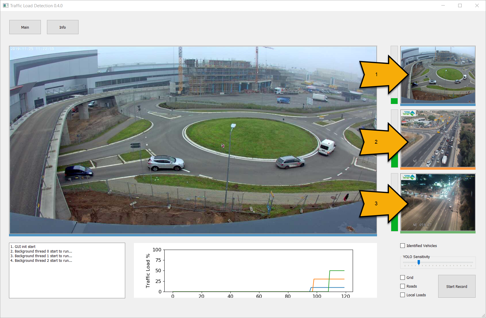
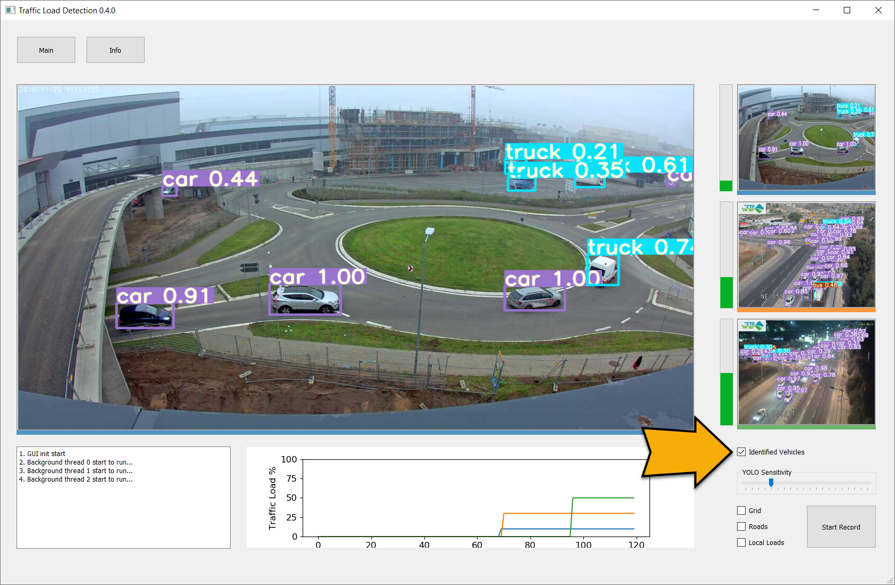
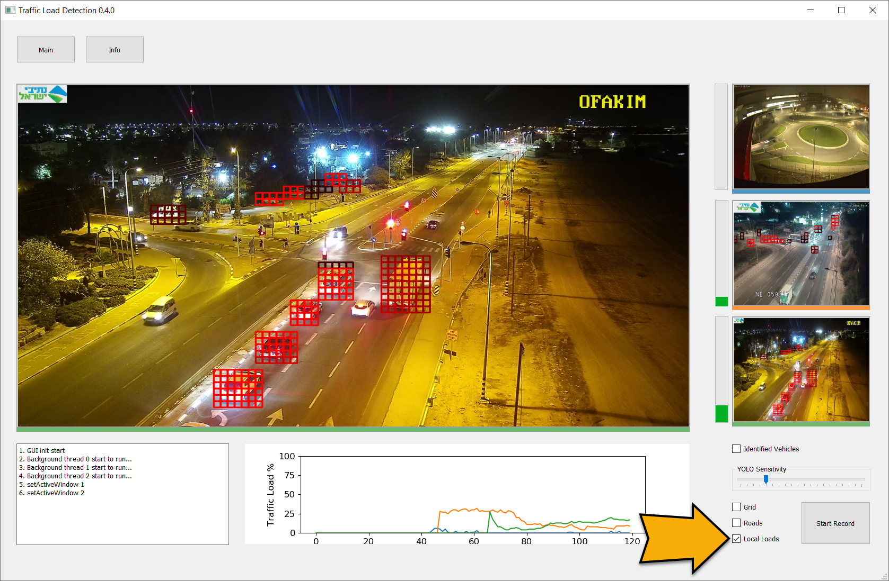
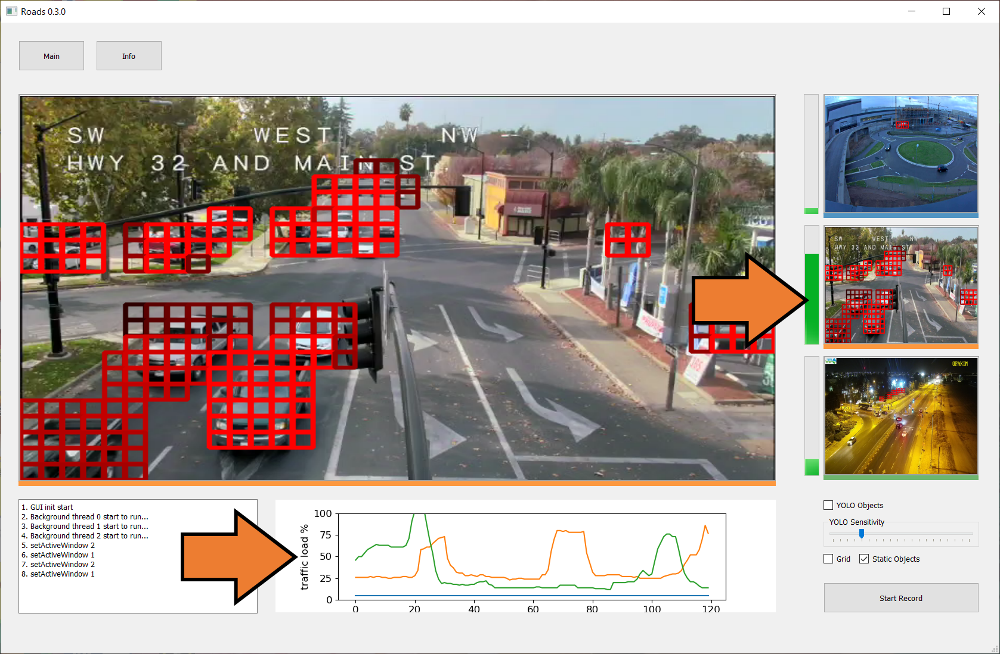

# Traffic Load Detection

This is the graduate project of **Perach Ben David** and **Yehuda Aharon Ezer** in Software Engineering Master's degree at Ort Braude College.  

The project topic is to implement traffic load detection based on YOLO algorithm, The YOLO implementation was took from https://github.com/ultralytics/yolov3.

# Installation

## Prerequisites
1. Windows 7 / 10 64bit
2. Python 3.7.x 64bit
3. CUDA Toolkit 10.x
4. NVIDIA GPU card (GTX 1050 and above)

## Downloading Project
1. Clone this repo:  
   `git clone https://github.com/aey76/Traffic-Load-Detection.git`
2. Download and extract yolo3_v6 and weights from the file Traffic-Load-Detection-yolo3_v6.7z located at 'https://drive.google.com/open?id=1viSKJuym6OeI9MbHxArtm6a1AYzug1s5' into the cloned repo directory.
3. pip install ./yolo3_v6/requirements.txt
4. pip install ./requirements.txt

# Running
Run ./gui_main.py

# Application Overview

1. Main window layout with view to 3 live webcams

---

2. Set "Identified Vehicles" check box to see the detected vehicles

---

3. Set "Local Loads" check box to see high load areas

---

4. See the green bar raise as the traffic load increase and the traffic load history graph updates

---

5. You can record traffic sessions by pressing the "Start Record" button and reply them later.

---

6. See ./arts/Traffic-Load-Detection_Demo_h265.mp4 video

---
